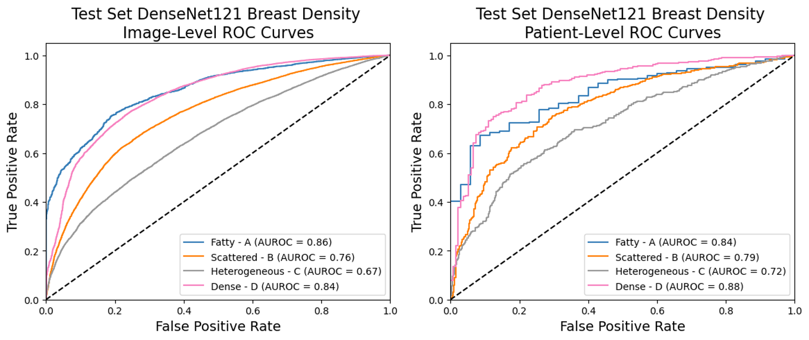

# Mammographic Density from BUS
---
## Deep Learning Predicts Mammographic Breast Density in Clinical Breast Ultrasound Images 
###### Github repository containing all relevant code for journal submission 
This repository is designed to provide implementation of the training, evaluation, and validation (via cancer risk modeling) for our deep learning model which predicts the ACR Breast Imaging and Reporting Data System (BI-RADS) breast composition for mammography categories from breast ultrasound (BUS).  

### Results


## Installation and system requirements
- Tested on Ubuntu 20.04.6 LTS
- Python version: 3.9.16
- To install dependencies, run:
```python3
python setup.py install
```

## Demo
* Demo scripts are provided in the outermost folder.
* Model checkpoint files (as used for results reported in the paper) can be downloaded from [here](https://drive.google.com/drive/folders/1T8ZGWdQgRCLmuHn6EKonS6acfYd0_l23?usp=drive_link).
* A sample dataset is provided purely to demonstrate model functionality, the dataset is not representative of the complete dataset used to train/evaluate the models in the manuscript.
* Demo files are described below:
    - `write_graylevels.py` pulls out image histograms from included datasets and saves them as pickle files.
    - `graylevel_method.py` does grid searches and saves predictions from an MLP, random forest and logistic regression models from the image histograms written above.
    - `generate_predictions.py` generates predictions from trained deep learning models.
    - `train.py` provides model training code, given optimal hyperparameters found during Optuns runs.
    - `cancer_risk.ipynb` provides the method for the sampling-based logistic regression model construction used for cancer risk estimates. **Note that the ORs and performance in this notebook are expected to be invalid**, due to the small size of the sample dataset provided. 
